## Contador de visitantes de Terminal 1 :office:

Terminal 1 es una franquicia de coworking. Como parte de la modernización de sus instalaciones han decidido implementar una serie de cambios. Uno de ellos es incorporar una interfaz para el registro de persona externas al coworking.

Es importante que esta app no pretende reemplazar a ninguna persona, por el contrario, será una herramienta de apoyo para la gente que está en los puestos de recepcionistas o de guardias de seguridad.

## Planteamiento del problema

Este contador está pensado principalmente para que exista un control interno por parte de Terminal 1 y controlar de una manera más eficiente a las personas que entran al espacio. 

La necesidad de hacer este contador reside en primer lugar: el aumento de los robos a negocios y casa habitación en la Ciudad de México ha aumentado drásticamente en los últimos años. Según el Secretariado Ejecutivo del Sistema Nacional de Seguridad Pública (SESNSP) la incidencia delictiva se incrementó un 11.4% en la Ciudad de México, siendo la delegación Cuauhtémoc, delegación donde se encuentran los dos edificios administrados por Terminal 1, una en las que más se notó un incremento en la actividad delictiva. 

Como consecuencia a estos hechos se decidió implementar este control de acceso para que la gente que renta un lugar en este coworking (miembro) se sienta protegido y respaldado por la administración de Terminal.

## Hipótesis

Los miembros y los administradores quieren una plataforma fácil de usar, con pocos botones.

Los miembros y los administradores del coworking quieren una plataforma en la que puedan agregar a más de un usuario a la vez. Esto para los eventos.

Los administradores quieren que los visitantes no toquen la plataforma. 

## Investigación

Para llegar a la comprobación de nuestras hipótesis se realizaron 3 entrevistas. La primera fue a Indira Gutiérrez, colaboradora de la startup EasyBroker, cuyas oficinas se encuentran en A255, coworking ubicado en la calle de Ámsterdam, número 255, colonia Condesa, delegación Cuauhtémoc; la segunda fue a Fabiola Pineda, administradora de A255; la tercera fue hecha a Batú Oliva, guardia de seguridad de We Work Insurgentes, con dirección en Insurgentes Sur, número 601, colonia Nápoles. (tanto las transcripciones de las entrevistas como los audios de estas se encuentran en el apartado de “Anexos”). Y además se hizo una visita encubierta a We Work Insurgentes, poniendo de pretexto el asistir a un taller en dichas instalaciones.

Con estas tres entrevistas y la visita encubierta dimos con varios puntos importantes para empezar a diseñar nuestro sitio y así diseñar pensando en nuestros principales usuarios.

### Crónica de la visita encubierta

Corría el lunes 6 de agosto del 2018. Mi compañera Sandra Salinas y yo, Andrea Valeriano, caminábamos por la calle Ámsterdam, buscando el número 255. En dicho lugar trabaja una amiga mía de la universidad: Indira Gutiérrez.

En la actualidad Indira es colaboradora de la startup EasyBroker, dedicada al giro inmobiliario, que debido al temblor acaecido en septiembre tuvo que mudarse de sus antiguas oficinas ubicadas en la avenida Álvaro Obregón a el edificio de coworking llamado “A255”.

Al llegar al lugar, tras una pequeña ventana un guardia de seguridad nos dio la bienvenida y después preguntó a quién veníamos a visitar. Yo le contesté con el nombre de mi amiga.

El oficial dirigió su vista a la pantalla de su computadora, hizo una pequeña interacción con ella y tras un breve silencio contestó “vienen con la señorita Indira, ¿verdad?”, al contestarle afirmativamente nos pidió esperar unos momentos y tras esperar aproximadamente como un minuto, nos dejó pasar.

La luz ámbar inundaba un estrecho pasillo donde se encontraba las escaleras, seguida del elevador y por último la recepción de A255.

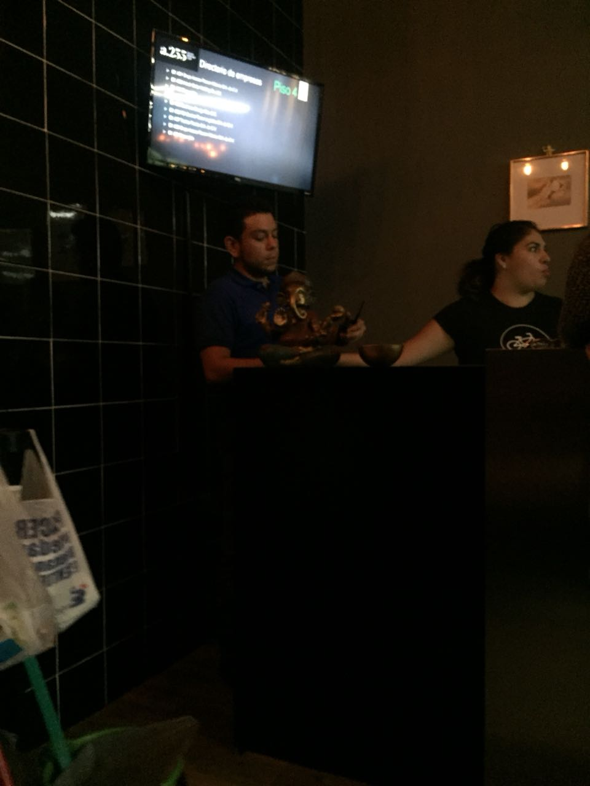

En dicha recepción se encontraban dos mujeres de aproximadamente 35 años, al vernos, nos pidieron esperar en una banca que se encontraba enfrente de la recepción.

La espera de mi amiga fue larga, debido a su carga de trabajo, cuando llegó y tras un breve saludo nos dirigimos al elevador para ir al piso donde ella trabaja. 

Tras platicar con ella y después de ir a la terraza del coworking decidimos partir. Al salir de edificio solo notamos que el guardia de seguridad solo se despidió de nosotros.

### Insight de las entrevistas

El primer punto: Las personas que visitan dichos espacios no están en contacto con la plataforma. Solo los administradores o guardias de seguridad pudieron verificar la información administrada previamente en su plataforma. Al preguntarles si les gustaría que los visitantes fueran los que interactuaran con la interfaz, contestaron negativamente pues ellos prefieren tener el control de los accesos ya que esto les da certidumbre de quién entra.

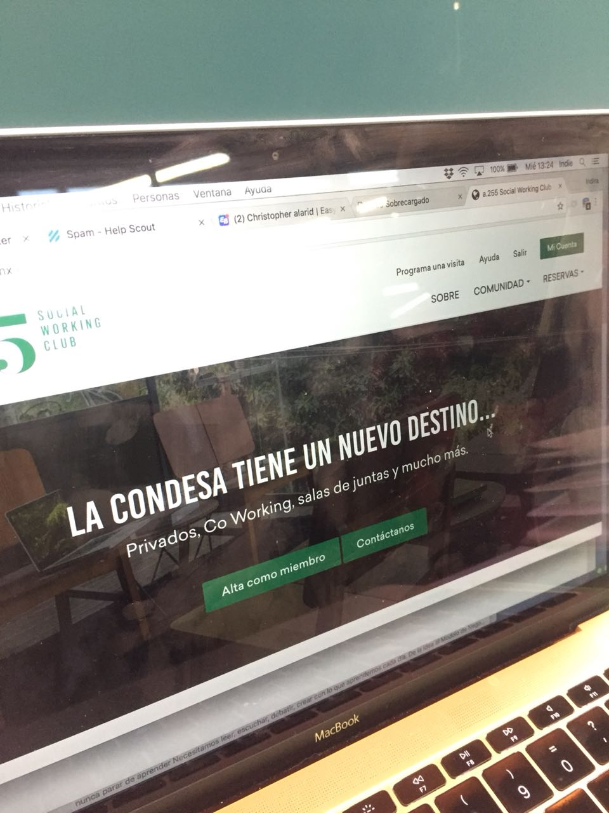
En Segundo lugar, detectamos un importante pain point con la miembro del coworking: que si tenían un evento tenían que registrar a cada invitado uno por uno. Por lo que decidimos atacar este problema al poner en nuestra plataforma que el miembro pueda ingresar a más de una persona a la vez, ahorrándole mucho tiempo.

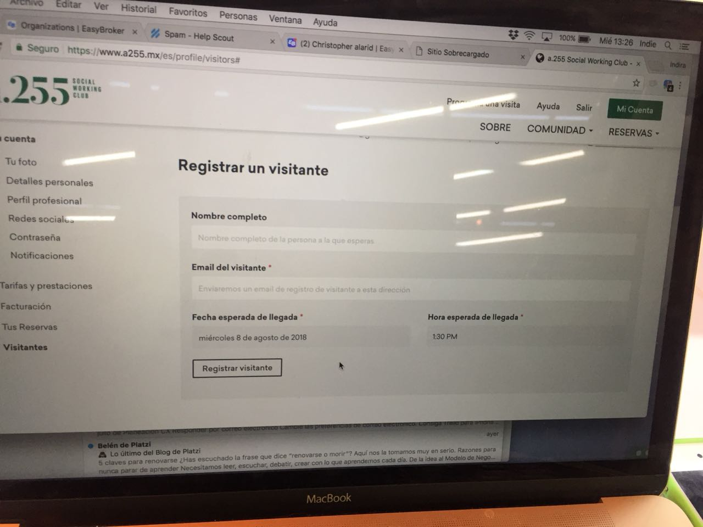

## Historia de Usuarixs

| Historia de Usuarix  Nr.1|
|---|
| Fecha:  08/08/2018|
| Nombre de la Usuaria:  Diana Sánchez |
| Edad: 28 años |

| Título: Registro |
| Voy a una entrevista de trabajo a una empresa cuyas oficinas están en un coworking. Gracias al tráfico voy con el tiempo justo para la entrevista. Temo que al llegar al coworking tenga que perder mucho tiempo en registrarme. Me gustaría que el registro fuera más rápido y ágil para no llegar tarde a mi entrevista.|
|Historia de Usuarix Nr.2|
|---|
|Fecha: 08/08/2018|
|Nombre de la Usuaria: Jorge Bolaño|
|Edad: 40 años|
|Título: Administración|
|Como gerente del edificio necesito de una plataforma en la que pueda ver la gente que entra a mi edificio. Su nombre, hora de entrada y su foto por si algún inconveniente surge. |
---------
|Historia de Usuarix Nr.3|
|---|
|Fecha: 08/08/2018|
|Nombre de la Usuaria: Adriana Sivan|
|Edad: 35 años|
|Título: Dar de alta|
|Soy la CEO de una Startup. En la actualidad estoy en busca de nuevos colaboradores. Como soy una persona muy ocupada no puedo perder mucho tiempo en registrar a la gente que venga a las entrevistas (hablar con recepción, informar quién viene y a qué hora y demás) Requiero de una plataforma en la que en los menos clics posibles pueda ingresar al sistema la persona que entrará.|
## Mockups
Con la información recabada en las entrevistas se procedió a realizar los primeros sketches (desafortunadamente las fotos de los sketches se perdieron gracias a problemas técnicos del celular donde se tomaron las fotos). 

Se decidió usar el programa Balsamic Mockup 3 para realizar los mockups y sobre ellos empezar a trabajar.

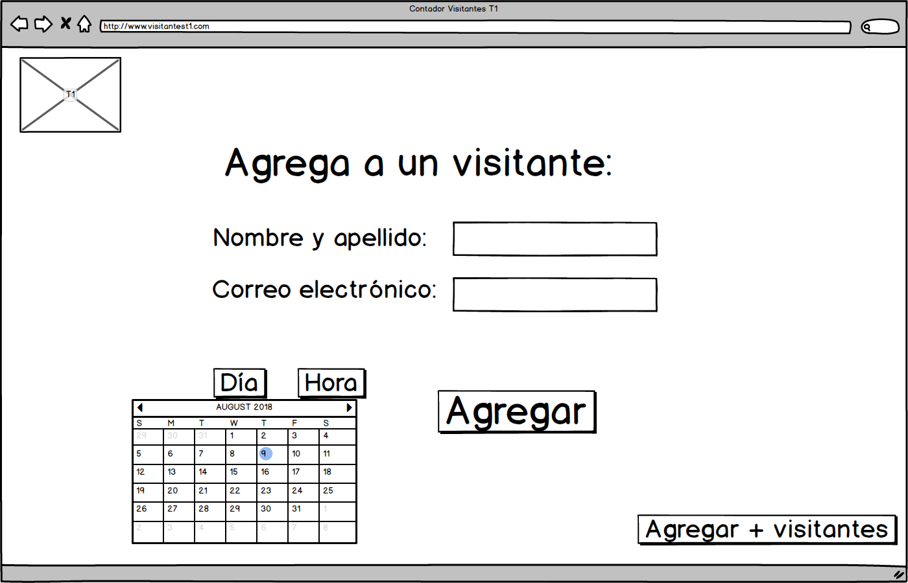

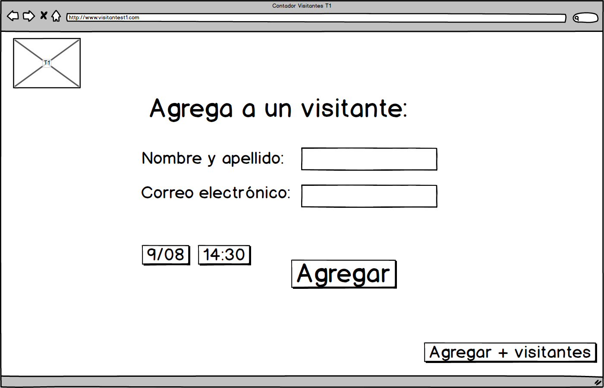

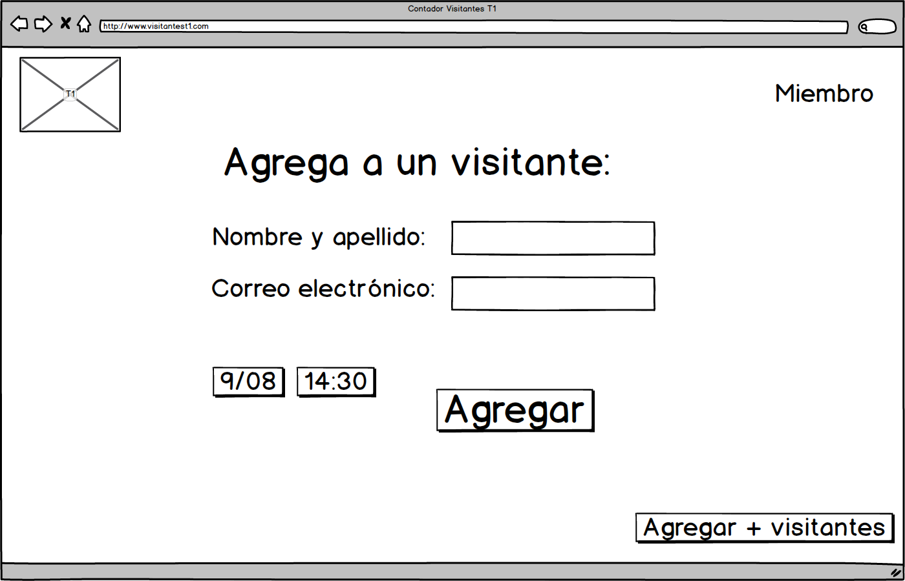

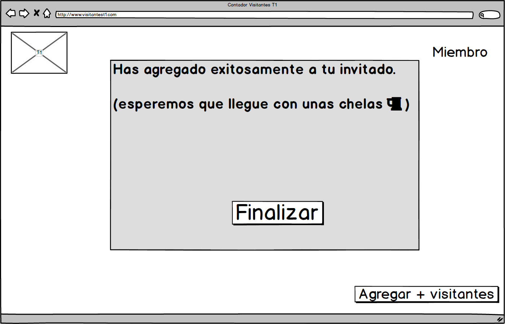

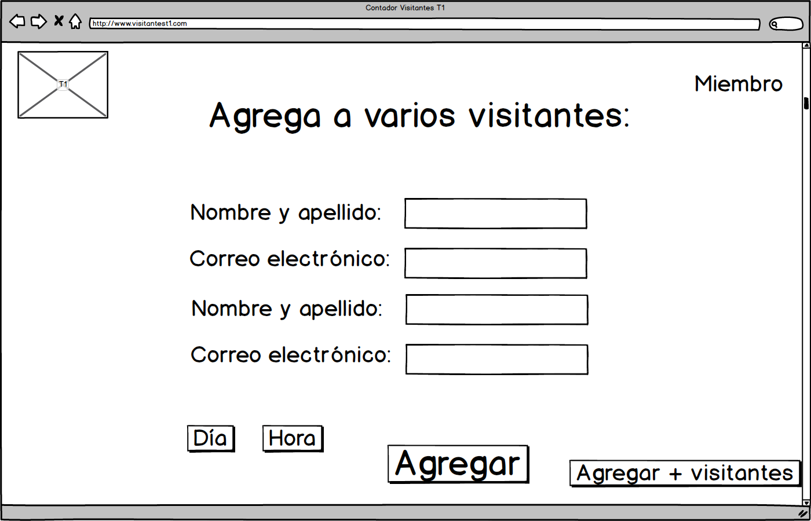

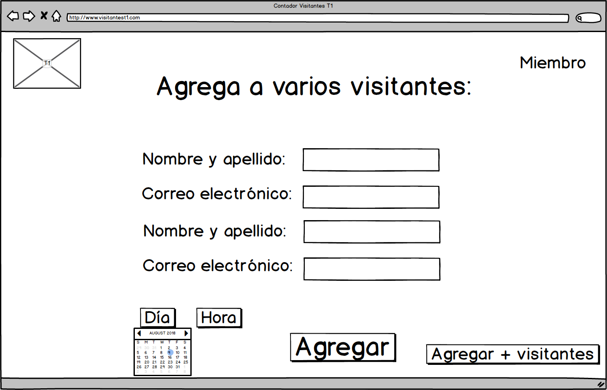

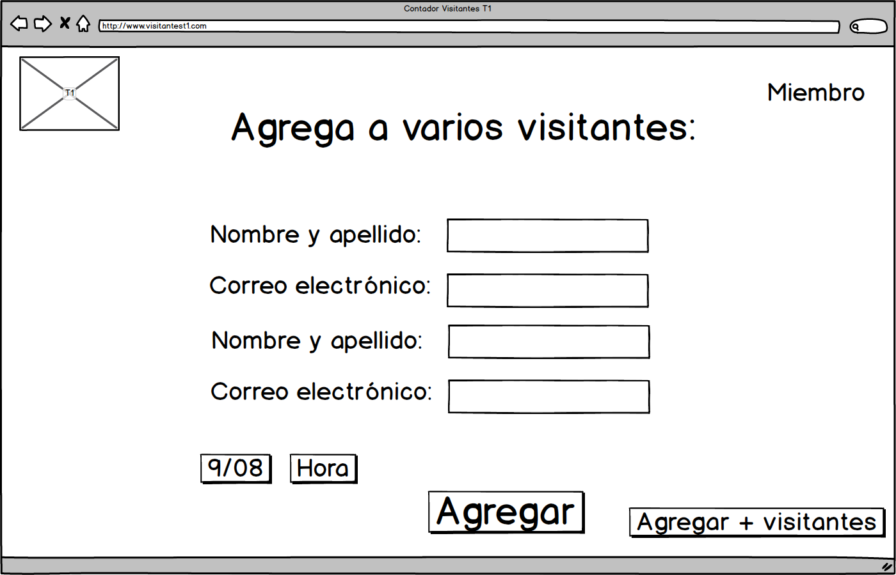

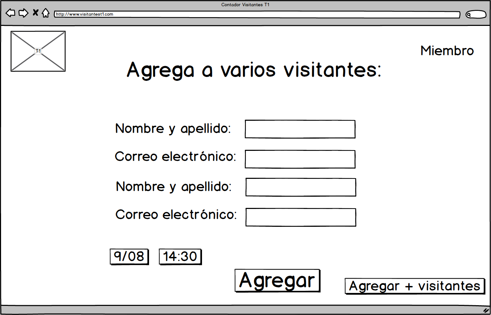

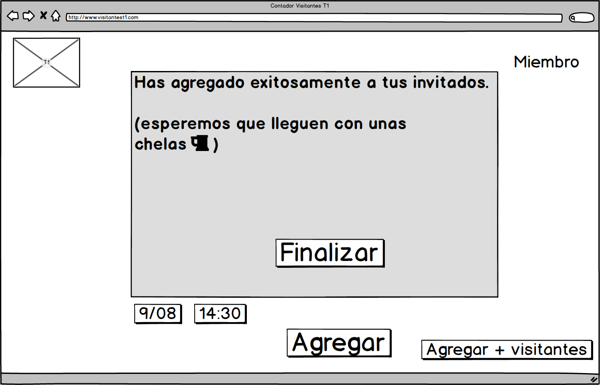

## Prototipo de alta fidelidad
Por cuestiones de tiempo solo se pudo hacer tres vistas de alta fidelidad, las cuales se plasman a continuación:

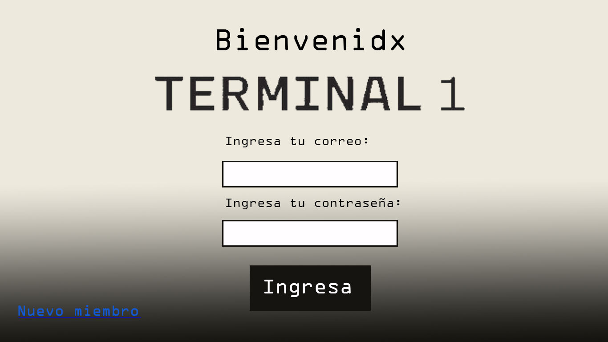

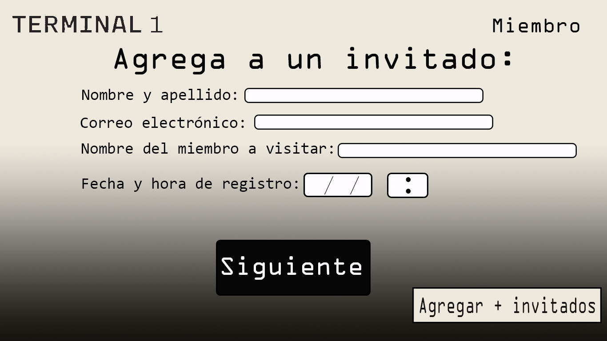

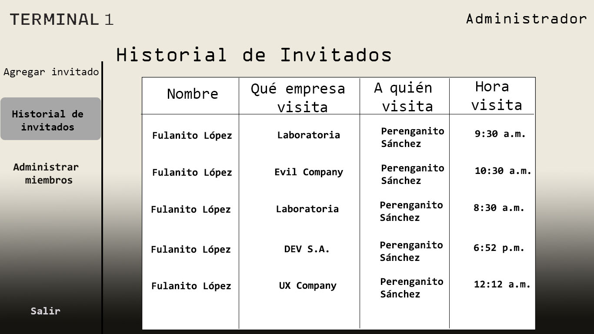

## Prototipo con flujo
El prototipo con flujo se encuentra alojado en la página web de Marvel App:

https://marvelapp.com/39didi4

## Aprendizaje del Feedback

Al realizar las entrevistas con posibles usuarios y recibir su feedback, salieron varios puntos a la luz:

Una de las trabajadoras cuya startup está en Terminal 1 le gustó que existiera el botón de “registrar + usuarios”, pero la jerarquía le pareció que no era la incorrecta, por lo que sugirió que el botón estuviera en el pop-up que sale al terminar de agregar a un usuario o bien que estuviera en otro lugar dentro de donde se encuentra.

A la misma usuaria le pareció importante que la funcionalidad del calendario y la hora fuera más dinámica.

Por el lado del guardia de seguridad le pareció muy importante que hubiera un registro con foto y un botón para volver.

En la medida de lo posible, se harán las adecuaciones obtenidas 
## Anexos

#### Transcripción de entrevista realizada a Fabiola Pineda, administradora de A255, edificio de coworking, ubicado en Ámsterdam 255, col. Condesa.

Sandra Salinas, Entrevistadora: Te vamos a platicar un poquito lo que estamos haciendo: Vamos a desarrollar una aplicación sobre registros para que sea más fácil poder llevar el registro de los visitantes. Entonces lo que nosotras queremos es que tu ahorita nos platiques un poquito la experiencia de la plataforma que utilizas para registrar, entonces te vamos a hacer un par de preguntas, pero primero quiero que me cuentes… si me puedes contar cómo es el proceso del registro de los visitantes desde tu punto de vista.
Fabiola Pineda, Administradora de A255: Pues ahorita tenemos poco menos de un mes que tenemos el biométrico y es por medio de la huella digital. Se les asigna numero y ya nosotros desde aquí lo coordinamos con el biométrico para que ya aparezca su nombre personalizado, para que ingresen…
EN: ¿Es la huella de quienes trabajan…
FF: Los miembros. Los que tienen oficinas o espacio de coworking.
EN: Y, por ejemplo, en el escenario que hoy esta Indira nos registró a Andrea y a mi ¿cómo es que te llega la información de que dos personas fueron registradas?
FF: Por que ella desde la plataforma de la pagina de internet tienen que meter a sus visitantes con el nombre completo y con el correo electrónico y eso nos llega a nosotros directo, entonces tenemos un apartado que es de visitantes en donde y ahí nos aparecen todos los miembros y los visitantes que registran.
EN: Al momento de hacerse el registro se actualiza automáticamente o ¿cómo es el proceso?
FF: Si, se va actualizando y ya nada más cuando llegan el vigilante manda una alerta al correo electrónico de la persona que ya ha llegado su visita para que puedan pasar.
EN: Tú tienes… hay un momento en el que tú le tengas que avisar a la persona que registró que ya está la gente dentro…
FF: De hecho, aquí manda la alerta y les llega el correo a ellas y también les llaman por cualquier cosa.
EN: ¿Y a ti te llega una alerta por correo electrónico?
FF: En cuanto, ya sea el vigilante o yo, le damos que ya ha llego la persona, me llega a mi correo electrónico y le debe de llegar a la persona.
EN: ¿Podría ver muy por encima cómo están…cómo funciona tu plataforma, ¿cómo están distribuidos nada más los espacios? Sin necesidad de ver información que no…
FF: Te va a aparecer toda la información de todos los socios, de todos los miembros conforme los van registrando.
EN: Y, por ejemplo, en el escenario donde llega una persona sin avisar, alguna visita…
FF: Lo registramos.
EN: Ustedes los registran ahí… ¿cuál es el proceso para registrarlo?
FF: Le pedimos el nombre completo y el correo electrónico.
EN: ¿Y dónde pones ese correo?
FF: En el apartado de visitas. Y ya pongo el miembro que vienen a visitar y nosotros ya tenemos en la plataforma toda la información de los miembros junto con su correo para que les pueda llegar la información.
EN: ¿Lo tienes de manera desplegable la información de los miembros?
FF: Eso está en un sistema que tenemos nosotros es privado.
EN: Y la manera en que se les avisa ¿cómo es?
FF: Por medio de correo electrónico.
EN: Es la misma dinámica de cuando alguien ya tiene previa cita a alguien que llega de manera aleatoria, ok. Y si tú, por ejemplo, pudieras mejorar algo de la plataforma, algo que te gustaría que tuviera como para que tus tiempos fueran, a lo mejor, un poquitos más rápidos o más amigables ¿Qué le mejorarías o qué le cambiarías?
FF: Pues siento que ahorita es muy rápido, el sistema es rápido porque te lo lanza todo por correo electrónico, entonces es rapidísimo porque nada más le apretamos que ha llegado y automáticamente le llega a la persona el correo a la persona.
EN: Ok, tú no has tenido algún problema, no hay nada que le gustaría cambiarle, mejorar.
FF: Pues no, porque más bien es de los miembros. Si ellos hacen sus registros de visitas no hay ningún problema. Si no lo hacen es un poco más tardado porque yo le tengo que registrar la información a las personas.
EN: ¿Y a la persona que llega se le da algún tipo de gafete o credencial?
FF: Se le da un gafete que tu los identificas como visita, no como miembro.
EN: y te gustaría, que a lo mejor, el proceso fuera… que tú no tuvieras que registrarlo sino que la misma persona que llega se registrara de manera digital, que ellos mismos registraran sus datos o es prácticamente igual.
FF: Yo siento que es prácticamente igual, porque es lo mismo que yo hago, pedirles información que nada más son el nombre completo y el correo. No necesitamos más información de la persona para poder avisarle al miembro que ya está aquí, por eso se me hace amigable porque siento que en otras empresas tienen que dar más datos, a que empresa vienen y aquí no, aquí si ya está registrado automáticamente nos aparece la información necesaria y le llega el correo a la persona a la que viene a visitar.
EN: ¿En caso de que falle el registro con internet… ha habido momentos en los que falle el internet y como… sí si ¿cómo es que lo han solucionado?
FF: Sí si también en vigilancia tienen una bitácora y toman la misma información y ya después lo pasamos al sistema, pero no ha habido mayor problema.
EN: Te gustaría que al momento de tener a un visitante poder tomarle una foto como tener esa parte más segura del registro, para saber quien está entrando al edificio.
FF: Pues de que me gustaría si, pero la verdad es que no lo veo muy rentable porque si para las huellas muchos pusieron peros porque es algo como personal, esa información, entonces para el registro de huellas fue difícil; para poner fotos no siento que sea rentable. Sería más molesto.
EN: Yo me imagino que iría en contra de la filosofía del coworking ¿no? 
FF: Si porque en si el tomado de huellas es para distinguir a los miembros de las visitas. Si tu eres miembro tienes que poner tu huella y nadie más puede entrar por la misma seguridad que tiene…
EN: Y te iba a preguntar también, para entrar al registro, para tu poder registrar a alguien tienes que iniciar sesión o cualquier persona puede acceder a…
FF: No, cuando ya eres miembro de aquí, de A255, se les da una cuenta y una contraseña, se les manda correo y solo así pueden ingresar a un sistema y hacer uso de todas las instalaciones.
EN: Pero tú que eres la que lleva el control de las que va recibiendo todas las que van entrando y todo eso, tu tienes que iniciar sesión,  poner algún correo y contraseña o.,.
FF: Si, para entrar a nuestra pagina
EN: ¿Y ese correo o contraseña, la contraseña tú la personalizaste o ya se te dio?
FF: No, yo la personalicé.
EN: Entonces, del perfil que tu tienes al perfil que tiene esta Indie es diferente, dime que es lo que…la diferencia.
FF: Que yo soy la administradora de la aplicación directamente.
EN: Tú le puedes cambiar cosas.
FF: Exactamente. Nosotros como administrador, como miembros directamente de A255 podemos hacer modificaciones del sistema.
EN: Me imagino que tu puedes quitar a miembros que ya no están…
FF: Exactamente. Activar, desactivarlos.
EN: Hoy es miércoles, mañana obviamente es jueves. ¿La información del miércoles se junta con la información del jueves o se guarda en algún lugar?
FF: No se junta, va como por día, y dependiendo. mañana me va a mostrar los que van a venir mañana y tenemos registros anteriores y visitantes antiguos que aparecen.
EN: Y por ejemplo, si tú quieres consultar los de el lunes como haces esa consulta.
FF: (ininteligible)
EN: Pero cuales son los pasos que tú tienes que dar a esa…
FF: Nada más poner visitantes antiguos…
EN: ¿Es a través de tal cual una frase que dice y que te despliega?
FF: Todos los visitantes. Me pone dentro de 21 días, hace dos horas, hace un día, hace dos horas.
EN:  Y te los muestra.
FF: Puedo buscar tanto por el nombre del visitante como por el nombre de la persona que viene, yo por ejemplo, Indira las registró a ustedes, yo puedo poner las visitantes que registró Indira, me van a salir todas las visitantes que ha tenido ella, todos
EN: Pero si puede escoger en específico el viernes tal, te aparece un calendario o como es la manera en que…
FF: Me aparece el mes y me aparecen los días y ya le doy clic y me aparece.
EN: ¿Cómo un calendario normal?
FF: Si.
EN: ¿Nada más me podrías dar tu nombre completo y tu cargo aquí?
FF: Soy administradora de A255 y mi nombre es Fabiola Pineda.
#### Entrevista Indira Gutiérrez, colaboradora de EasyBroker, startup cuyas oficinas se encuentran en Ámsterdam,255, colonia Condesa, Ciudad de México. Realizada el lunes 6 de agosto del 2018.
Indira Gutiérrez, inquilina del coworking A255: (inaudible)… sin INE ni nada era así de a vengo al taller y ya pasaban, a veces si pedían como identificación, pero era muy aleatorio.
EN: ¿Pero el registro tú lo entregabas con la hoja y luego él tenía que transcribir esa misma información?
IG: Aja, la ponía como en un Excel.
EN: Y suponiendo que tenías una visita de algún cliente o de alguna persona externa, siempre el registro era ¿de qué manera era?
IG: Ahí nada más avisaban que llegaba, bajabas por él y ya que veían que tú eras te dejaban pasar dejando una INE, como entrevista de trabajo.
EN: ¿Y de qué manera te avisaban, algún medio que utilizaran?
IG: Teléfono, eran muy rústicos. 
EN: ¿Y en Terminal 1?
IG: En T1 la seguridad es mucho más elevada, la cantidad también de personas se restringe de los que tengan acceso, nos pedían siempre enviar por email previamente por correo la lista de asistentes o avisar las personas que iban a ir, y no estoy muy segura de su sistema, por qué no lo llegue a ver, pero había una persona policía y una recepcionista además que en las computadoras tenían ya la base de datos previa para dejar pasar a la gente. Si no estás en la lista no te dejamos pasar o nos llamaban para “oye ¿puede acceder?”, “si” y ya lo dejaban, pero siempre pedían una identificación oficial que dejaban para poder ingresar.
EN: ¿Y a los visitantes se les entregaba alguna credencial para poder estar dentro o solo pasaban?
IG: No, solo pasaban, era nada más como justo el registro, la validación al inicio cuando llegaban, pero no se entregaba ningún tipo de credencial.
EN: Y aquí el registro, por ejemplo, ¿de qué manera te avisaron que Sandra y Andrea habían llegado?
IG: Fue súper cool, porque yo estaba trabajando y entonces me llegaron las notificaciones del correo, porque yo le puse a qué hora… tentativamente van a llegar, y yendo un poco como por partes la plataforma es esta: 255, y nos piden que todos, no solo los visitantes, sino también todo lo que nosotros necesitemos de reportes de impresoras y cosas así lo hagamos desde aquí.
EN: (Inaudible)
IG: Si, aquí casi nada es de ir personalmente y decirles todo bien acá, entonces yo aquí en mi cuenta tengo una sección del perfil y así y acá dice visitantes, (inaudible) y nosotros la interfaz es realmente muy práctica, yo no he recibido muchos visitantes. 
Lo de los talleres no queda acá en el listado o queda en un listado general, y si se fijan están acá estos, y ya me llega acá la notificación por correo de esta manera: “llegaron tus visitantes”.
EN: Y te iba a preguntar ¿Entonces cualquier visitante que tú tengas tiene que tener previa cita o cuando ha habido momentos en los que llegue alguien de improvisto, como se maneja ahí?, ¿has visto más o menos como se maneja con los guardias o siempre tiene que ser con previa cita que tú avises?
IG: No, ahí sí ha llegado sobre todo clientes que luego llegan de repente, déjame preguntar si ha habido alguien ha tenido experiencia de eso porque yo no he visto.
EN: No, si quieres ahorita lo checamos.
IG: Si, porque he visto cuando he estado allí que veo que hacen fila y notifican a las personas de “oye te esta esperando tal” y creo que dejan una INE con el policía, es lo que me he dado cuenta.
EN: ¿Y te gusta la plataforma, la forma en que tú das de alta a los usuarios, sientes que es complicada?
IG: No, de hecho, fue muy sencillo, solo voy a “visitantes” y aquí viene ya el registro, como ves no me piden muchos datos, pero si siempre es obligatorio el email, no piden tanto el teléfono, y nos sirve también a nosotros porque tenemos el email por nuestra parte cuando confirmamos lo del taller y enviamos también una notificación para los clientes.
EN: ¿Y si pudieras cambiar algo, mejorar algo en cuanto a la plataforma que podría ser? Por ejemplo, a lo de visitas.
IG: Aquí, por ejemplo, pienso que podría tener como un botón de visitas frecuentes como para ya los datos que tengo nada más ponerles un cambio de fecha para ir agregando, a lo mejor viene semanalmente y aquí pues el registro es de nada más de una sola vez, aunque si te fijas es también bastante cómodo el calendario o la esperada de llegada.
EN: Y esta plataforma, dices que haces más cosas a parte de dar de alta como a visitantes, ves lo de las copias y otras cosas.
IG: Acá justo están como comentarios de la comunidad, por ejemplo tenemos el panel de mensajes donde alguien pidió un cargador y es todo el edificio, toda la red de los coworkers donde dicen, aquí también pusieron de lo de promoción, esto es un reporte de que no servía muy bien el internet, este también tuvo problemas de impresión, ah y este es nuestro de nuestra UX Designer puso aquí un anuncio de que estamos buscando personas para testear nuestra plataforma y quien quiere y así.
EN: ¿Y te gusta que esté todo en una sola plataforma o te gustaría a lo mejor que lo de las visitas fuera independiente?
IG: No, si está padre que este todo en una sola plataforma, igual a lo mejor se me hace como la fórmula de tener el menú acá como lo de visitantes hasta muy lejos o algo, me gustaría personalmente, o a lo mejor aquí en inicio está , fueran como… a lo mejor que fueran botones más grandes, como esto, y que aquí tuviera todo a donde ir; no tener que ir a mi cuenta y luego en la parte izquierda hasta abajo o algo así.
EN: ¿Si tuvieras que hacerle ahorita un cambio a lo de visitas donde pondrías esto? 
IG: Justo entrando a mi cuenta, que tuviera ahí los acceso.
EN: ¿Podrías decir que, en la página principal, suponiendo que tenemos esta pantalla que dice aquí registros visitantes?
IG: Aja, exacto que viniera registro de visitantes, reportes y todo, así como un Dashboard o algo así, me gusta más ese estilo de interacción.
EN: ¿Te gustaría entonces una menor cantidad de pasos?
IG: Aja, exactamente. Y también, no recuerdo bien, pero creo que no tiene APP, solo es en la página web y no me he fijado si puedo acceder desde el celular, seguramente puedo acceder, pero no nos dicen "baja la APP" como en Wework. ¿Si han visto la de WeWork? En WeWork está super padre, porque justo ya no es en la compu, sino desde el celular y también tiene muchísimas más características, como que también puedes reservar una sala de cualquier piso para una reunión y programas el tiempo y todo y ya nadie más la va a ocupar, entonces eso está ahí muy bueno. 
Dentro de otras cosas que tenemos aquí justo estoy hablando de la de A255 social .... es lo de la renta de bicicletas, (inaudible) bueno esto es para reservar salas de juntas y según tu plan te van poniendo ahí los precios para nosotros esto sería gratuito, ya las demás van teniendo costo, y también lo de bike rentas lo puedes programar (inaudible), a esta casi nunca como que he entrado, como que si alguien del equipo lo necesita tenemos una feed manager que hace todo esto.
EN: Con lo de los eventos que hacen, es como previa cita también, ¿no? ¿tú tienes que decirle al dueño quienes van a venir como una lista?
IG: Si, al administrador siempre, y no es tanto como una lista, sino que los vamos poniendo allí nosotros incluso si tenemos un excel donde vamos poniendo los nombres y los correos, pero finalmente ella se encarga de meter aunque si son 40 uno por uno todos ahí.
EN: ¿Y podríamos revisar tu interfaz?, lo que pasa es que tengo una pregunta que quiero hacerte en la parte de visitantes.
IG: Estaría de hecho ahora que lo dices padre, poder subir un listado de Excel porque esto de estar…que es de verdad hemos registrado 40 gentes.
EN: Suponiendo, en el escenario de editar un nombre que escribieras mal Sandra Salinas ¿solo tiene el botón de borrar?
IG: Eliminar.
EN: No existe un botón ¿verdad?
IG: Registrar visitante y ya.
EN: ¿Y ya no lo puedes editar, ¿verdad?
IG: No. Y mira me llego esta notificación de te han registrado como visitante, porque a ustedes les llego a su correo ¿no?
EN: Si. Pero me llama la atención lo del botón de editar porque esa información también le llegará un correo al administrador, entonces hay que ir con el administrador para ver que hace por si hay ese tipo de errores ¿Te gustaría que hubiera algo para una edición, no sé, poder editar nombres en caso de su correo o tú consideras que no es mejor ahorita?
IG: Creo que si sería útil, es como prever que puede pasar algo que no está considerado, como que no es de pues me equivoco pues lo elimino y aunque lleguen mil notificaciones ni modo, pero obviamente en lo usabilidad pues si estaría bien prevenir todos estos tipos de cosas.
EN: Entonces, nada más confirma,e: cuando llega un visitante que no está pre registrado, si les llegará una notificación o les avisarán nada más por teléfono.
IG: Ah cuando no está...
EN: Registrado, que llegue por ejemplo ahorita Pablo y Pablo te quiere ver a ti y no tiene cita entonces el aviso es a través de un teléfono, correo.
IG: Es solo por teléfono. Sobre todo cuando nos traen comida, por ejemplo de Rappi o así, siempre es así de” buscan a la señorita Indira”, “ah ahorita bajo” y ya nada más afuera de la puerta y así. Y también si alguien llega para dejarte algo, correos, mensajería, si te avisan por teléfono, pero no hacen un registro.
EN: ¿Por correo no te llega?
IG: No.
EN: ¿Entonces, en caso de que tú no estés a que teléfono te llaman?
IG: Al celular. Es que a lo que tiene acceso la persona es justo aquí al perfil profesional o personal, donde vienen todos los detalles del teléfono, todo lo que se pone aquí, entonces a este teléfono es donde me van a marcar.
EN: ¿Y han existido ocasiones en las que no te han podido encontrar? Que hayas dejado tu teléfono y no hayas podido contestar.
IG: Una vez por comida, pero porque decidí no contestar porque ya estaba bajando y fue como de “ah le estaba marcando señorita”, pero no pasa más que hablarlo con el policía.
EN: Digamos ¿que los policías tienen como su base de datos en la que no es necesario decir como a que oficina vas, nada más con el puro nombre te buscan o cómo funciona?
IG: Aja, ellos ponen en la base de datos que tiene el nombre de la persona y ya les sale en el sistema, por eso es prácticamente obligatorio tener tu cuenta dada de alta y con todos los datos.
EN: Si, porque se me hizo curioso que nada más dicen tu nombre ni siquiera tu apellido. Fue de “ah, si. Vengo con ella” y “ah si, las tengo aquí, ya pueden pasar”.
IG: Seguro por las notificaciones que ya van teniendo del día, ahí quien sabe si la que yo eliminé ahorita, como dices tú, no les llega la notificación de fue borrada.
EN: ¿Cuándo ellos te notifican que ya llegó alguien, tú tienes que contestar de leído, enterado o no lo dejes pasar o algo? ¿O es como de ya llegaron?
IG: Pues no fíjate, nada más me llegó la notificación que vimos en el correo y ya yo creo que si no bajaba, trataban de localizarme vía telefónica. Porque he visto justo que si de entrar con acompañante para que tengas acceso a todo el lugar.
EN: Yo creo que sería todo.

##### Audios
[Entrevista a Fabiola Pineda]( https://drive.google.com/open?id=1VTcBUdeRGUPNs2QsavP00Im-N-Tm9DhE)
[Entrevista a Indira Gutiérrez]( https://drive.google.com/open?id=1lrTIAeZjfnNoewNEySd3-h13cpI-W2Uq)
[Entrevista a Barú Minero]( https://drive.google.com/open?id=1IxdWLA66MitGmeyMIEANsZ5daGpiJvKV)

##### Videos
Primera prueba de usuario]( https://drive.google.com/file/d/1S-4VwYgN4bnbC0NDW4Mk54vPYnwJvoXP/view?usp=sharing)
[Segunda prueba de usuario]( )
[Tercera prueba de usuario]( )
[Cuarta prueba de usuario]( )
[Quinta prueba de usuario]( )

##### Audios, videos y fotos se encuentran en la siguiente url

[Anexos]( https://drive.google.com/open?id=1V2HJcdHESgIFzPzamvhatZU348ZF5hUm)
